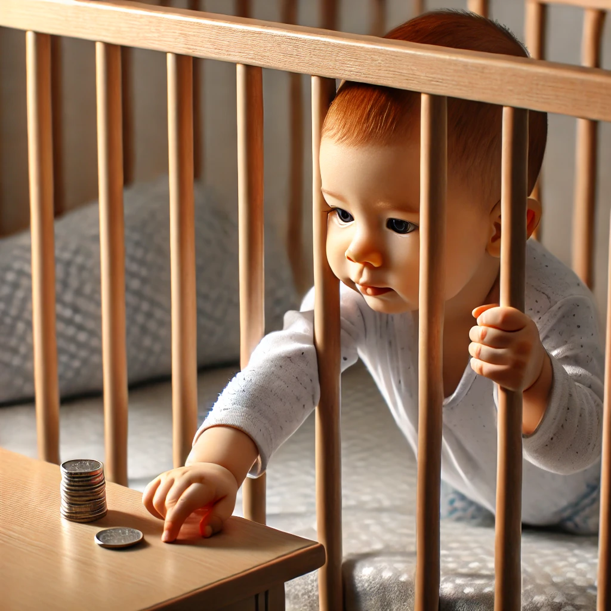
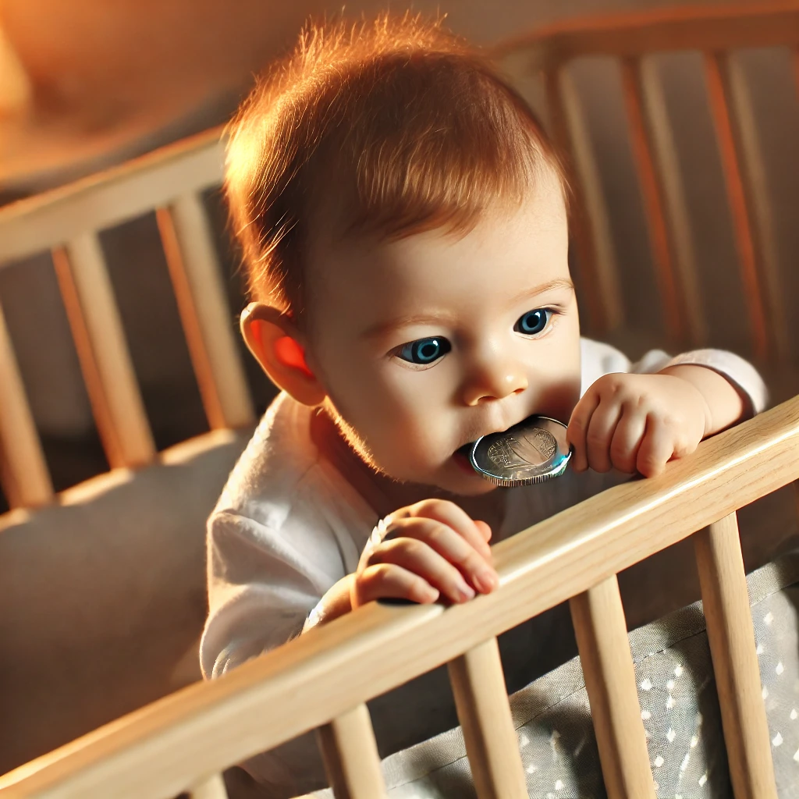
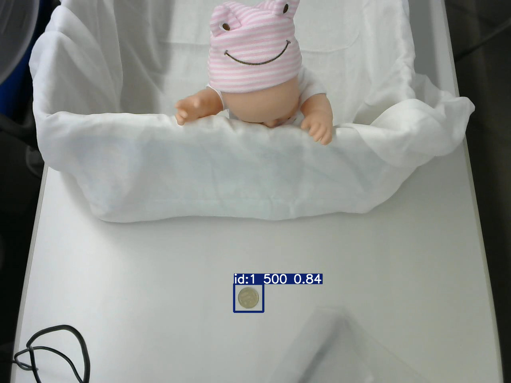
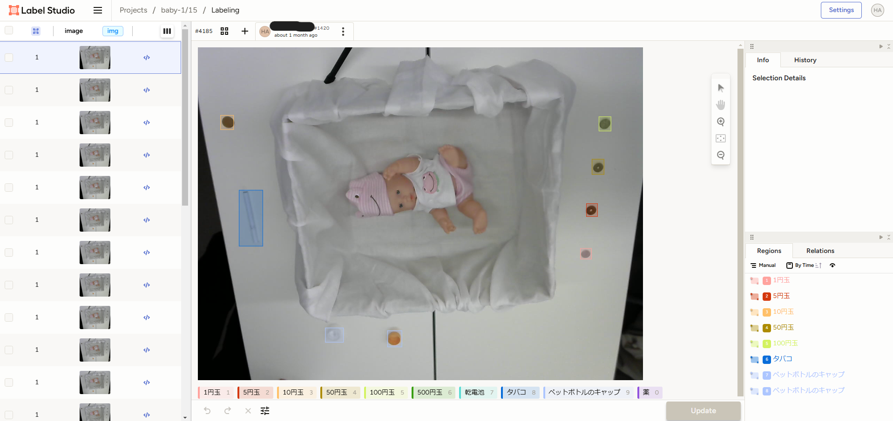

# Introduction
## Protect children from accidental ingestion
Babies are curious explorers, often placing themselves at risk of accidental ingestion. Data from 2017 indicates that children aged 0–4 face a high rate of ingestion and choking incidents, underscoring the need for vigilant monitoring. By teaching an NVIDIA Jetson system to detect potential hazards—small objects such as toys, metal, plastics, and more—our “Bafety Bot” quickly identifies threats and helps parents respond. This project aims to significantly lower ingestion-related accidents, enhance overall child safety daily, and ultimately reduce parents' worries.





## About my project
  
We set up a camera to monitor the area around the cradle and placed Jetson, the “brain” for detecting foreign objects that could be easily swallowed, nearby. When a foreign object is detected, the “Bafety_Bot,” a Discord bot we created, sends a notification to the parents' smartphones, as illustrated in the photo below.

&nbsp;


   

[video of our project](https://youtu.be/cFqFbPmqbig)  


# How to run
## Requirements
I confirm by the following environment.
* Hardware
  * Jetson Orin Nano Development Kit
  * Logicool Web Camera
* Software
  * Python3.x

## Preparation before run
Before starting this project, please set up your Jetson Orin Nano according to the following information.
* Install uv or pipx, or use venv and install dependencies.

## Clone github
```bash
$ cd
$ git clone https://github.com/adulty-babies/Bafety_Bot
```

## Run
This project works with python and the required dependencies; you will need to install the dependencies in venv or run it with a tool that supports PEP 723.
The python program that was running on the video is `realtime_test_ja.py`.
`test.py` is the program to run on the video once taken to get whether it was detected.
`realtime_test.py` and `realtime_test_ja.py` require the webhook url of discord in the WEBHOOK_URL environment variable.
Both tools allow you to optionally set the path to the weights to be used. (Default is `./weights/best.pt`)

### When operating with real-time camera images
```bash
# Run python program.
WEBHOOK_URL="https://discord.com/api/webhooks/..." pipx run ./realtime_test.py

# Point it at the area you want to monitor.
```

### When detecting from video
```bash
# Run python program. (weight is optional.)
pipx run ./test.py input.mp4 output_path.mp4 weight.pt
```

# Data Collection
## Take a video
Collect data for training AI with videos and photos. Place small objects in the area to be monitored and take videos and photos.  

During data collection, by fixing the camera's height and angle, standardizing the floor's color and material, and capturing images under conditions representative of the actual production environment, we significantly improved the detection accuracy of small objects that could be accidentally ingested by infants.

## Annotations
The annotations were labeled using Label Studio with the template "Object Detection with Bounding Boxes".



> [!NOTE]
> We stored our dataset on S3 compatible storage, so the description assumes this.

# Train
We fine-tuned a pre-trained model of yolo using a labeled dataset. Training in powerful GPU server.
```bash
cd tools
# generate all in one zip (train.zip) from annotated data.
pipx run ./preprocess.py "/path/to/json-min-style-annotation-data-exported-from-Label-Studio.json"
# transfer all in one zip.
scp ./train.zip gpu-server:/path/to/anywhere/
# ssh to GPU server
ssh gpu-server
cd /path/to/anywhere/
# extract train.zip
unzip train.zip
cd train
# start training.
bash ./run.sh

# A trained model can be found in "./runs/detect/train/weights/best.pt".

# Back to(Go to) jetson.
exit
# Get trained model.
scp gpu-server:/path/to/anywhere/runs/detect/train/weights/best.pt .
```

# Future Direction
* Increasing the number of training samples for each type of foreign object  
→ Improves the detection accuracy for that specific object

* Training on a wider variety of data
(such as children, clothes, backgrounds, etc.)  
→ Enables the detection of a greater variety of foreign objects

* Detecting foreign objects around the area using four mounted cameras  
→ Allows for more accurate monitoring of a wider area, including near the cradle, which a single camera might miss due to blind spots

* Adding features such as sounding a buzzer on-site for warnings, rather than just sending a smartphone notification  
→ Even if the parent isn’t always carrying their smartphone at home, they can immediately notice any foreign objects


# References
* We referenced the following URL when writing this Readme:  
[Sho-N/BabyWatcher](https://github.com/Sho-N/BabyWatcher).

